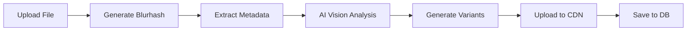

# kibanCMS - Arquitetura Técnica Completa

> **Documentação técnica detalhada** do sistema, arquitetura, e todas as funcionalidades implementadas.
> Este documento serve como referência para desenvolvimento e manutenção.

## 📋 **Índice**

1. [Visão Geral](#visão-geral)
2. [Arquitetura Core](#arquitetura-core)
3. [Sistema de Packages](#sistema-de-packages)
4. [Base de Dados](#base-de-dados)
5. [Sistema Multi-língua](#sistema-multi-língua)
6. [Dynamic Schema Provider](#dynamic-schema-provider)
7. [Media Processing & AI](#media-processing--ai)
8. [Segurança & Permissões](#segurança--permissões)
9. [Sistema de Add-ons](#sistema-de-add-ons)
10. [Frontend & UI](#frontend--ui)
11. [APIs & Integrações](#apis--integrações)
12. [Performance & Otimização](#performance--otimização)

---

## 🎯 **Visão Geral**

O kibanCMS é um **Headless CMS enterprise-grade** construído com uma filosofia única:

### **Princípios Fundamentais**

1. **Configuration over Code** - Tudo configurado via manifesto JSON
2. **Package-based Distribution** - Distribuído como NPM packages
3. **AI-First** - Processamento inteligente integrado nativamente
4. **Type-Safe** - TypeScript estrito em todo o sistema
5. **Multi-tenant Ready** - Isolamento por organização desde a raiz
6. **i18n Native** - Multi-língua na base de dados, não adicionado depois

### **Stack Tecnológica**

```yaml
Backend:
  - Database: PostgreSQL 15+ (Supabase)
  - Extensions: PostGIS, pgvector, pg_trgm
  - Auth: Supabase Auth (JWT)
  - Storage: Supabase Storage
  - Functions: Deno Edge Functions

Core:
  - Language: TypeScript 5.3+
  - Runtime: Node.js 18+
  - Validation: Zod
  - Build: TSup + Rollup

Frontend:
  - Framework: React 18+
  - State: TanStack Query
  - Forms: React Hook Form + Zod
  - Styling: Styled Components
  - Animations: Framer Motion
```

---

## 🏗️ **Arquitetura Core**

### **Diagrama de Arquitetura**

```
┌─────────────────────────────────────────────────────────────┐
│                         CLIENT APP                          │
│                    (React/Next.js/Remix)                    │
└────────────────────┬────────────────────────────────────────┘
                     │
        ┌────────────▼────────────┐
        │    @kiban/ui            │ ◄── React Components
        │  (Presentation Layer)    │     (Auto-generated UI)
        └────────────┬────────────┘
                     │
        ┌────────────▼────────────┐
        │    @kiban/hooks         │ ◄── React Hooks
        │   (State Management)     │     (useContent, useMedia)
        └────────────┬────────────┘
                     │
        ┌────────────▼────────────┐
        │    @kiban/core          │ ◄── Business Logic
        │    (Data Access Layer)   │     (Services, Repositories)
        └────────────┬────────────┘
                     │
        ┌────────────▼────────────┐
        │    @kiban/media         │ ◄── Asset Management
        │  (Processing & AI)       │     (Optimization, Vision)
        └────────────┬────────────┘
                     │
     ┌───────────────▼───────────────┐
     │         SUPABASE              │
     │  ┌────────────────────────┐  │
     │  │   PostgreSQL + RLS     │  │ ◄── Data Layer
     │  ├────────────────────────┤  │
     │  │   Edge Functions       │  │ ◄── Processing
     │  ├────────────────────────┤  │
     │  │   Storage (CDN)        │  │ ◄── Media Files
     │  └────────────────────────┘  │
     └───────────────────────────────┘
```

### **Fluxo de Dados**

1. **Manifest** → Define estrutura
2. **SchemaProvider** → Valida e processa
3. **KibanClient** → Orquestra serviços
4. **Services** → Lógica de negócio
5. **Repositories** → Acesso a dados
6. **Supabase** → Persistência

---

## 📦 **Sistema de Packages**

### **@kiban/core**

```typescript
// Estrutura do package
packages/core/
├── src/
│   ├── client/          # KibanClient principal
│   ├── services/        # Serviços de negócio
│   │   ├── ContentService.ts
│   │   ├── MediaService.ts
│   │   ├── AIService.ts
│   │   └── ...
│   ├── repositories/    # Data access
│   ├── schema/          # Dynamic Schema Provider
│   ├── middleware/      # Security, Cache, Validation
│   ├── plugins/         # Sistema de plugins
│   └── utils/           # Helpers
```

**Responsabilidades:**
- Lógica de negócio framework-agnostic
- Comunicação com Supabase
- Validação e sanitização
- Cache e otimização
- Sistema de eventos

### **@kiban/ui**

```typescript
// Componentes auto-gerados
packages/ui/
├── src/
│   ├── generators/      # Form/Table generators
│   │   ├── DynamicFormGenerator.tsx
│   │   ├── DynamicTableGenerator.tsx
│   │   └── DynamicRouter.tsx
│   ├── components/      # Design System
│   ├── layouts/         # Shell, Sidebar, Header
│   └── primitives/      # Base components
```

**Responsabilidades:**
- Componentes React
- Geração automática de UI
- Design system monocromático
- Layouts responsivos

### **@kiban/media**

```typescript
// Asset management
packages/media/
├── src/
│   ├── services/        # Processing service
│   ├── components/      # Media Library UI
│   ├── workers/         # Web Workers
│   └── utils/           # Blurhash, optimization
```

**Responsabilidades:**
- Upload e processamento
- AI Vision integration
- Otimização automática
- Blurhash generation

### **@kiban/types**

```typescript
// TypeScript definitions
packages/types/
├── src/
│   ├── database.types.ts
│   ├── schema.types.ts
│   ├── api.types.ts
│   └── index.ts
```

**Responsabilidades:**
- Type definitions compartilhadas
- Interfaces e enums
- Garantir type safety

---

## 🗄️ **Base de Dados**

### **Tabelas Principais**

```sql
-- 1. ORGANIZATIONS (Multi-tenancy)
organizations
├── id (UUID)
├── slug (unique)
├── settings (JSONB)
└── subscription_tier

-- 2. PROFILES (Users)
profiles
├── id → auth.users
├── organization_id → organizations
├── role (enum: admin, editor, viewer)
├── permissions (JSONB array)
└── preferences (JSONB)

-- 3. CONTENT_NODES (Polymorphic content)
content_nodes
├── id (UUID)
├── organization_id
├── type (page, post, product, etc)
├── content_blocks (JSONB - AST structure)
├── geo_location (PostGIS POINT)
├── content_embedding (pgvector)
├── status (draft, published, archived)
└── seo_config (JSONB)

-- 4. CONTENT_TRANSLATIONS (i18n)
content_translations
├── node_id → content_nodes
├── locale (pt, en, es, fr, de)
├── title
├── slug
├── content_blocks (JSONB translated)
└── seo_title, seo_description

-- 5. MEDIA_ASSETS
media_assets
├── id (UUID)
├── storage_path
├── blurhash
├── dimensions (JSONB)
├── detected_objects (JSONB - AI)
├── alt_text (AI-generated)
└── content_embedding (pgvector)

-- 6. AUDIT_LOGS
audit_logs
├── user_id
├── action (create, update, delete)
├── entity_type
├── changes (JSONB diff)
└── ip_address
```

### **Row Level Security (RLS)**

```sql
-- Exemplo de política
CREATE POLICY "Users can only see their org data"
ON content_nodes FOR SELECT
USING (
  organization_id IN (
    SELECT organization_id
    FROM profiles
    WHERE id = auth.uid()
  )
);
```

### **Triggers & Functions**

```sql
-- Auto-update timestamps
CREATE TRIGGER update_updated_at
BEFORE UPDATE ON content_nodes
FOR EACH ROW EXECUTE FUNCTION update_updated_at_column();

-- Version control
CREATE TRIGGER create_revision
AFTER UPDATE ON content_nodes
FOR EACH ROW EXECUTE FUNCTION create_content_version();

-- Webhook dispatch
CREATE TRIGGER trigger_webhooks
AFTER INSERT OR UPDATE ON content_nodes
FOR EACH ROW EXECUTE FUNCTION dispatch_webhook_event();
```

---

## 🌍 **Sistema Multi-língua**

### **Arquitetura i18n**

```typescript
// 1. ESTRUTURA NA DB
{
  content_node: {
    id: "uuid",
    // Dados globais (não traduzíveis)
    status: "published",
    created_at: "2024-01-01",

    // Traduções relacionadas
    translations: [
      {
        locale: "pt",
        title: "Título em Português",
        slug: "titulo-portugues",
        content_blocks: [...],
        seo_title: "SEO PT"
      },
      {
        locale: "en",
        title: "English Title",
        slug: "english-title",
        content_blocks: [...],
        seo_title: "SEO EN"
      }
    ]
  }
}

// 2. CONSUMO NO FRONTEND
const { data } = await supabase
  .from('content_nodes')
  .select(`
    *,
    translations!inner(*)
  `)
  .eq('translations.locale', currentLocale)
  .eq('status', 'published');

// 3. FALLBACK AUTOMÁTICO
const content = getContentWithFallback(nodeId, 'pt', 'en');
```

### **Features i18n**

- ✅ **URLs localizados**: `/pt/artigo`, `/en/article`
- ✅ **SEO tags automáticas**: hreflang, og:locale
- ✅ **Tradução AI**: OpenAI/DeepL integration
- ✅ **Editor side-by-side**: 2 línguas em paralelo
- ✅ **Status tracking**: % de tradução por língua

---

## 🎯 **Dynamic Schema Provider**

### **Como Funciona**

```typescript
// 1. MANIFEST DEFINE ESTRUTURA
const manifest = {
  collections: [{
    slug: 'posts',
    fields: [
      {
        name: 'title',
        type: 'text',
        required: true,
        validation: [
          { type: 'min', value: 3 },
          { type: 'max', value: 100 }
        ]
      },
      {
        name: 'content',
        type: 'blocks',
        allowedBlocks: ['paragraph', 'image', 'quote']
      }
    ]
  }]
};

// 2. SCHEMA PROVIDER PROCESSA
const schemaProvider = new SchemaProvider(manifest);

// 3. GERA VALIDADOR ZOD AUTOMÁTICO
const validator = schemaProvider.getValidator('posts');
// Equivale a:
z.object({
  title: z.string().min(3).max(100),
  content: z.array(z.any())
});

// 4. GERA CONFIGURAÇÃO DE FORMULÁRIO
const formConfig = schemaProvider.generateFormConfig('posts');
// Returns:
{
  fields: [...],
  layout: 'single',
  sections: [...],
  validation: zodValidator
}

// 5. UI RENDERIZA AUTOMATICAMENTE
<DynamicFormGenerator
  collection={collection}
  schemaProvider={schemaProvider}
/>
```

### **Tipos de Campos Suportados**

```typescript
type FieldType =
  // Text
  | 'text' | 'textarea' | 'richtext' | 'slug' | 'email' | 'url'

  // Numbers
  | 'number' | 'integer'

  // Boolean
  | 'boolean' | 'switch'

  // Date/Time
  | 'date' | 'datetime' | 'time'

  // Selection
  | 'select' | 'multiselect' | 'radio' | 'checkbox' | 'tags'

  // Media
  | 'media' | 'image' | 'file'

  // Advanced
  | 'color' | 'geo' | 'location' | 'json' | 'blocks'

  // Relations
  | 'relation' | 'reference';
```

---

## 🤖 **Media Processing & AI**

### **Pipeline de Processamento**



### **AI Vision Features**

```typescript
// Edge Function: ai-vision
const aiTasks = [
  'generate_alt_text',    // SEO alt text
  'detect_objects',       // Object detection
  'extract_text',         // OCR
  'detect_faces',         // Face detection
  'suggest_tags',         // Auto-tagging
  'dominant_colors'       // Color palette
];

// Resultado
{
  alt_text: "A modern office with minimalist design",
  detected_objects: [
    { label: "desk", confidence: 0.95 },
    { label: "laptop", confidence: 0.92 }
  ],
  tags: ["office", "workspace", "minimal", "modern"],
  dominant_colors: ["#FFFFFF", "#000000", "#F5F5F5"]
}
```

### **Otimização Automática**

```typescript
// Breakpoints responsivos
[320, 640, 768, 1024, 1366, 1920]

// Formatos gerados
['webp', 'avif', 'jpg']

// Exemplo de output
{
  original: "image.jpg",
  variants: [
    "image-320w.webp",
    "image-640w.webp",
    "image-768w.webp",
    // ...
  ],
  blurhash: "L6PZfSi_.AyE",
  srcset: "image-320w.webp 320w, image-640w.webp 640w..."
}
```

---

## 🔒 **Segurança & Permissões**

### **Níveis de Segurança**

```typescript
// 1. AUTHENTICATION (Supabase Auth)
- JWT tokens
- Refresh tokens
- Session management
- MFA support

// 2. AUTHORIZATION (RBAC)
enum UserRole {
  SUPER_ADMIN,  // Total access
  ADMIN,        // Org access
  EDITOR,       // Content CRUD
  AUTHOR,       // Own content only
  VIEWER        // Read-only
}

// 3. ROW LEVEL SECURITY
- Organization isolation
- User-based filtering
- Status-based visibility

// 4. FIELD LEVEL SECURITY
{
  name: 'salary',
  type: 'number',
  permissions: {
    read: ['admin', 'hr'],
    write: ['admin']
  }
}

// 5. AUDIT TRAIL
- All actions logged
- IP tracking
- Change diffs
- Retention policies
```

### **Middleware Stack**

```typescript
// Execução em ordem
1. RateLimitMiddleware    // Prevent abuse
2. AuthMiddleware         // Verify JWT
3. PermissionMiddleware   // Check roles
4. ValidationMiddleware   // Validate input
5. SanitizationMiddleware // Clean data
6. CacheMiddleware        // Check/Set cache
7. LoggingMiddleware      // Audit trail
```

---

## 🔌 **Sistema de Add-ons**

### **Add-ons Registry & Manager**

O kibanCMS utiliza um sistema de Add-ons baseado em micro-manifestos. Cada Add-on é um pacote independente que se regista no `AddonRegistry`.

#### **AddonRegistry**
Gere o ciclo de vida dos add-ons:
- **Registo**: Validação do manifesto e metadados via Zod.
- **Ativação**: Execução de hooks de ativação e criação automática de tabelas.
- **Configuração**: Persistência em `addon_configs`.
- **Injeção**: Disponibiliza componentes, rotas e itens de menu para a UI.

#### **Criação Automática de Tabelas**
Quando um Add-on é ativado, o Registry cria automaticamente as tabelas necessárias no Supabase:
```typescript
// Exemplo de definição de tabela no manifesto
database: {
  tables: [{
    name: 'submissions',
    columns: [
      { name: 'id', type: 'UUID PRIMARY KEY', default: 'uuid_generate_v4()' },
      { name: 'data', type: 'JSONB', notNull: true }
    ]
  }]
}
```

#### **UI Injection**
A UI do kibanCMS consome os add-ons via hooks, injetando componentes em pontos específicos.
```typescript
const { sidebarItems, components } = useAddons(manager);
```

### **Add-ons Disponíveis (v1.0)**

- ✅ **Cookie Notice**: Banner de consentimento GDPR personalizável com log de conselhos.
- ✅ **Contact Form**: Criação de formulários com submissão automática para DB e notificações.
- ✅ **Newsletter**: Gestão de subscritores com suporte a segmentos.
- ✅ **SEO Meta**: Gestão global e por página de meta tags e Social Graph (OpenGraph/Twitter).

---

## 🎨 **Frontend & UI**

### **Design System Monocromático**

```typescript
// Paleta estrita
const colors = {
  black: '#000000',
  white: '#FFFFFF',
  gray: {
    50: '#FAFAFA',
    // ... até
    950: '#0A0A0A'
  }
};

// Componentes base
<Button variant="primary|secondary|ghost" />
<Input type="text|number|email" />
<Table data={[]} columns={[]} />
<Card title="" description="" />
```

### **Layouts Disponíveis**

```typescript
// 1. MAIN SHELL
<MainLayout>
  <Sidebar />      // Navegação
  <Header />       // Top bar
  <Content />      // Main area
  <Omnibar />      // CMD+K
</MainLayout>

// 2. FOCUS MODE
<FocusMode>        // Distraction-free
  <Editor />
</FocusMode>

// 3. MEDIA LIBRARY
<MediaLibrary>     // Bento grid
  <UploadZone />
  <Gallery />
  <Inspector />
</MediaLibrary>
```

### **Keyboard Shortcuts**

```typescript
const shortcuts = {
  'cmd+k': 'Open omnibar',
  'cmd+s': 'Save',
  'cmd+n': 'New item',
  'cmd+/': 'Help',
  'cmd+\\': 'Toggle sidebar',
  'cmd+.': 'Focus mode',
  'esc': 'Cancel/Close'
};
```

---

## 🔄 **APIs & Integrações**

### **REST API (via Supabase)**

```typescript
// GET content
GET /rest/v1/content_nodes?status=eq.published

// POST content
POST /rest/v1/content_nodes
Body: { title, content, status }

// RPC functions
POST /rest/v1/rpc/find_similar_content
Body: { target_id: "uuid", max_results: 10 }
```

### **Webhooks**

```typescript
// Eventos disponíveis
[
  'content.created',
  'content.updated',
  'content.published',
  'content.deleted',
  'media.uploaded',
  'user.login',
  'ai.task.completed'
]

// Configuração
{
  url: 'https://your-endpoint.com/webhook',
  events: ['content.published'],
  secret: 'hmac-secret',
  retries: 3
}
```

### **Integrações Externas**

```typescript
// OpenAI
- GPT-4 Vision for alt text
- Embeddings for semantic search

// Google Cloud
- Vision API for object detection
- Natural Language for entities

// CDN/Media
- Cloudflare Images
- Cloudinary transformations

// Analytics
- Plausible/Umami integration
- Custom event tracking
```

---

## ⚡ **Performance & Otimização**

### **Estratégias de Cache**

```typescript
// 1. QUERY CACHE (React Query)
{
  staleTime: 5 * 60 * 1000,      // 5 min
  cacheTime: 10 * 60 * 1000,     // 10 min
  refetchOnWindowFocus: false
}

// 2. CDN CACHE
Cache-Control: public, max-age=31536000, immutable

// 3. DATABASE CACHE
- Materialized views for aggregations
- Indexed columns for search
- Prepared statements

// 4. EDGE CACHE (Cloudflare)
- Static assets: 1 year
- API responses: 5 minutes
- Media files: Forever (immutable)
```

### **Otimizações Implementadas**

```typescript
// 1. LAZY LOADING
- Componentes com dynamic imports
- Imagens com IntersectionObserver
- Infinite scroll para listas

// 2. BUNDLE OPTIMIZATION
- Tree shaking
- Code splitting por route
- Minification com Terser

// 3. IMAGE OPTIMIZATION
- Blurhash placeholders
- Responsive srcset
- WebP/AVIF com fallback
- Lazy loading nativo

// 4. DATABASE OPTIMIZATION
- Índices em campos de busca
- JSONB para dados flexíveis
- Partitioning por organização
- Connection pooling
```

### **Métricas de Performance**

```yaml
Target Metrics:
  - FCP: < 1.5s
  - LCP: < 2.5s
  - FID: < 100ms
  - CLS: < 0.1
  - Bundle size: < 200KB gzipped
  - API response: < 200ms p95
```

---

## 🚀 **Deployment & DevOps**

### **Infraestrutura Recomendada**

```yaml
Production:
  Database: Supabase Pro (ou self-hosted)
  CDN: Cloudflare
  Hosting: Vercel/Netlify
  Monitoring: Sentry
  Analytics: Plausible

Development:
  Database: Supabase Free
  Storage: Local/Supabase
  Testing: Vitest + Playwright
  CI/CD: GitHub Actions
```

### **Environment Variables**

```bash
# .env.production
VITE_SUPABASE_URL=https://xxx.supabase.co
VITE_SUPABASE_ANON_KEY=xxx
VITE_OPENAI_API_KEY=sk-xxx
VITE_GOOGLE_VISION_API_KEY=xxx
VITE_SENTRY_DSN=xxx
```

---

## 📊 **Monitorização & Observability**

### **Logging Strategy**

```typescript
// Níveis de log
enum LogLevel {
  DEBUG,    // Development only
  INFO,     // General info
  WARN,     // Warnings
  ERROR,    // Errors
  CRITICAL  // System failures
}

// Structured logging
{
  timestamp: "2024-01-01T00:00:00Z",
  level: "ERROR",
  service: "MediaProcessingService",
  userId: "uuid",
  organizationId: "uuid",
  error: {
    message: "Failed to process image",
    stack: "...",
    context: { fileSize: 10485760 }
  }
}
```

### **Métricas Tracked**

```typescript
// Business metrics
- Content created/published
- Media uploaded/processed
- User activity
- API usage

// Technical metrics
- Response times
- Error rates
- Cache hit ratio
- Database connections

// AI metrics
- Tokens consumed
- Processing time
- Accuracy scores
```

---

## 📝 **Resumo Executivo**

O **kibanCMS v1.0** é uma plataforma CMS enterprise que:

1. **Elimina código repetitivo** através de geração automática de UI
2. **Escala horizontalmente** com arquitetura multi-tenant
3. **Integra AI nativamente** para otimização e metadata
4. **Suporta multi-língua** desde a base de dados
5. **Distribui como biblioteca** para máxima reutilização
6. **Garante segurança** com RLS e audit trail completo
7. **Otimiza performance** com cache multi-layer
8. **Mantém simplicidade** com design monocromático

**Estado atual: Production-Ready** ✅

---

*Documento gerado em: 2024-04-01*
*Versão: 1.0.0*
*Autor: Kiban Engineering Team*